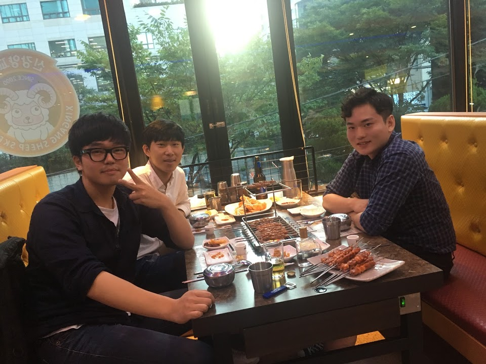

#collaboration-process
team twiiks 협업 프로세스



- 커밋 메시지 형식 참고
```
Summarize changes in around 50 characters or less

50자 또는 그 이하로 변경 사항을 요약

More detailed explanatory text, if necessary. Wrap it to about 72
characters or so. In some contexts, the first line is treated as the
subject of the commit and the rest of the text as the body. The
blank line separating the summary from the body is critical (unless
you omit the body entirely); various tools like `log`, `shortlog`
and `rebase` can get confused if you run the two together.

필요하다면 더 자세한 설명을 서술한다. 한 행은 72자 정도에서 변경한다.
맥락에 따라서 첫 행이 커밋의 제목처럼, 나머지 내용이 본문처럼 다뤄지는
경우도 있다. 첫 행의 요약과 본문 사이에 빈 행을 넣는 것은 중요하다.
(물론 본문을 입력하지 않는 경우라면 무관하다) 이 규칙을 지키지 않은
경우에는 `log` 또는 `shortlog`, `rebase`와 같은 도구를 사용할 때
혼란스러울 수 있다.

Explain the problem that this commit is solving. Focus on why you
are making this change as opposed to how (the code explains that).
Are there side effects or other unintuitive consequences of this
change? Here's the place to explain them.

이 커밋이 해결한 문제에 관해 설명한다. 어떻게 문제를 해결했는지 설명하기
보다는 왜 이런 변화를 만들었는가에 집중한다. ("어떻게"는 코드가 설명한다.)
이 변경으로 인해 나타나는 부작용이나 직관적이지 않은 결과가 나타나는가?
이 내용을 여기에서 설명한다.

Further paragraphs come after blank lines.

문단을 더 추가하고 싶다면 문단 사이에 빈 행을 넣는다.

 - Bullet points are okay, too

 - 개조식 서술도 괜찮음

 - Typically a hyphen or asterisk is used for the bullet, preceded
   by a single space, with blank lines in between, but conventions
   vary here

 - 블릿(bullet)으로 하이픈(-)이나 별표(*)를 사용하고, 한 칸의 공간을
   띄고 시작하며, 각 항목 사이 빈 행을 넣는 방식이 일반적이나 다양한
   관례가 있음

If you use an issue tracker, put references to them at the bottom,
like this:

만약 이슈 트래커를 사용한다면 다음처럼 내용 하단에 참조를 추가한다.

Resolves: #3
See also: #1, #2

해결: #3
참고: #1, #2
```

- 좀더 간단하게쓰자ㅏㅏㅏㅏㅏ
```
50자 또는 그 이하로 변경 사항을 요약

무엇을 하엿는지 서술

이 커밋이 해결한 문제에 대한 서술

이슈 트래커를 사용
Redmine: #3
See Also: #1, #2

```


작업시간 기록이 될까?
